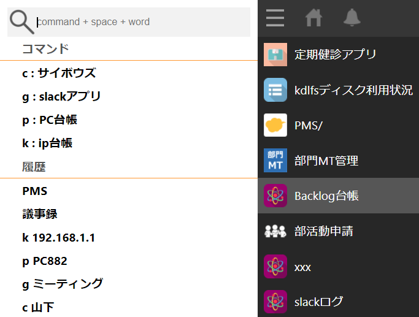

# kintone-extension-search
kintone用のGoogle拡張機能。  
kintoneの検索を便利にします。

## Description
拡張機能の検索フォームから様々なアプリの検索を可能にします。  
アプリはキーとなる「コマンド」と一緒に事前に設定しておき、  
検索時に「キー」＋「検索したいワード」で直接アプリを検索します。  

***DEMO:***  

* 検索画面  

* 設定画面  
 
## Usage
kintone extension search はURLクエリ内の ***「xxxx」*** を検索ワードに置換します。

### 基本検索
1. kintoneのトップページの「全体検索」に「xxxx」を入力
2. 検索結果のURLをコピー
3. kintone extension search のオプションを開いて「基本検索」にコピーしたURLを貼り付けて「Save」
4. 拡張機能を起動してkintoneで検索したいワードを入力してEnter
5. kintoneの検索結果が開きます

### kintone
1. 登録したいkintoneのホスト名を入力

### コマンド
特定のアプリで検索をしたい場合に使用します。  

1. 「kintoneのアプリ内検索」に「xxxx」を入力
2. 検索結果のURLをコピー
3. kintone extension search のオプションを開いて「URL」にコピーしたURLを貼り付け
4. 「コマンド」には好きな文字を入れる（この文字でコマンドかどうか判定します）
5. 「説明」にはわかりやすいようにURLの説明を入れ「Save」
6. 拡張機能を起動して設定した「コマンド」のあとに半角スペース + 検索したいワードを入力してエンター
7. kintoneの検索結果が開きます

## Installation
***Chrome webstore***  
https://chrome.google.com/webstore/detail/kintone-extension-search/mgbdmlpflafibjhcjnakcfdnihlgaodc  

## Author
cyamax

## License
MIT License